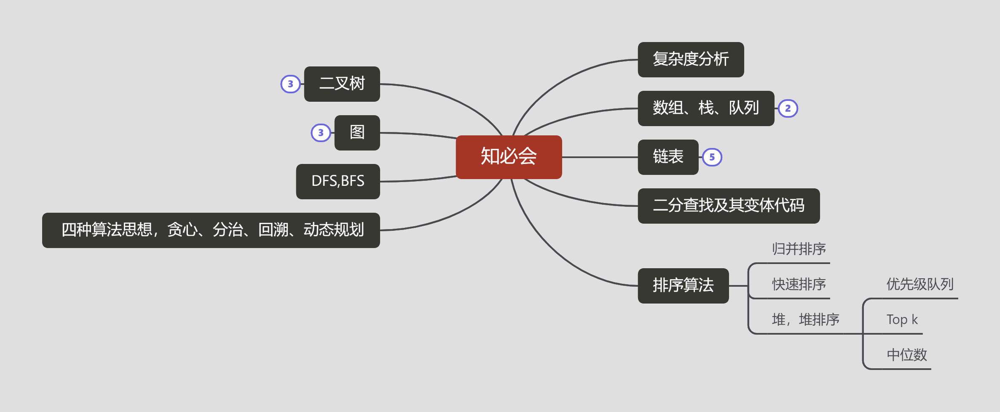

# 算法

# Leetcode
[知必会](https://github.com/wangzheng0822/algo),[LeetCode](https://github.com/yuanguangxin/LeetCode),[labuladong](https://labuladong.gitbook.io/algo/)
### [排序](./排序.md)
### [二叉树](./二叉树.md)
### [二叉搜索树](./二叉搜索树.md)
### [链表](./链表.md)
### [二分查找](./二分查找.md)
### [数组](./数组.md)
### [栈](./栈.md)
### [滑动窗口](./滑动窗口.md)
### [回溯(DFS)](./回溯.md)
### [BFS（广度优先遍历）](./BFS.md)
### [动态规划](./动态规划.md)
### [子序列与子串](./子序列与子串.md)
### [贪心与区间](./贪心与区间.md)
### [数据结构设计](./数据结构设计.md)
### [随机与概率](./随机与概率.md)
### [数学运算技巧](./数学运算技巧.md)
### [算法常见问题](./算法常见问题.md)

### 回文
leetcode第9题

    public boolean isPalindrome(int x) {
        if(x<0||(x%10==0&&x!=0)){
            return false;
        }

        int reverNumber=0;
        while(x>reverNumber){
            reverNumber=reverNumber*10+x%10;
            x/=10;
        }
        return x==reverNumber || x==reverNumber/10;
    }
    
回文字符串,leetcode第125题

    public boolean isPalindrome(String s) {
        int n=s.length();
        int left=0;
        int right=n-1;
        while(left<right){
            while(left<right&& !Character.isLetterOrDigit(s.charAt(left))){
                left++;
            }
            while(left<right && !Character.isLetterOrDigit(s.charAt(right))){
                right--;
            }
            if(left<right){
                if(Character.toLowerCase(s.charAt(left))!=Character.toLowerCase(s.charAt(right))){
                    return false;
                }
                left++;
                right--;
            }
        }
        return true;
    }
### 字符串相乘
leetcode第43题

    public String multiply(String num1, String num2) {
        int m = num1.length(), n = num2.length();
        int[] res = new int[m+n];
        for(int i = m-1; i >= 0; i--){
            for(int j = n-1; j >= 0; j--){
                int sum = (num1.charAt(i)-'0')*(num2.charAt(j)-'0');
                int p1 = i+j, p2 = i+j+1;
                sum += res[p2];
                res[p2] = sum%10;
                res[p1] += sum/10;
            }
        }
        int i = 0;
        while(i < res.length && res[i] == 0){
            i++;
        }
        StringBuilder sb = new StringBuilder();
        for(;i < res.length; i++){
            sb.append(res[i]+"");
        }
        return sb.length() == 0 ? "0" : sb.toString();
    }

    
### 灯泡开关
leetcode第319题

	public int bulbSwitch(int n) {
        return (int)Math.sqrt(n);
    }
    
### 石头游戏
leetcode第877题

    public boolean stoneGame(int[] piles) {
        return true;
    }
    
    
### 吃葡萄
    long solution(long a, long b, long c) {
        long[] nums = new long[]{a, b, c};
        Arrays.sort(nums);
        long sum = a + b + c;

        // 能够构成三角形，可完全平分
        if (nums[0] + nums[1] > nums[2]) {
            return (sum + 2) / 3;
        }
        // 不能构成三角形，平分最长边的情况
        if (2 * (nums[0] + nums[1]) < nums[2]) {
            return (nums[2] + 1) / 2;
        }
        // 不能构成三角形，但依然可以完全平分的情况
        return (sum + 2) / 3;
    }
    
### 煎饼排序
leetcode第969题

    class Solution {
         List<Integer> list=new ArrayList<>();
        public List<Integer> pancakeSort(int[] arr) {
            sort(arr,arr.length);
            return list;
        }
       
        public void sort(int[] arr,int n){
            if(n==1){
                return;
            }
            int max=0;
            int maxIndex=0;
            for(int i=0;i<n;i++){
                if(arr[i]>max){
                    max=arr[i];
                    maxIndex=i;
                }
            }
            reverse(arr,0,maxIndex);
            list.add(maxIndex+1);
            reverse(arr,0,n-1);
            list.add(n);
            sort(arr,n-1);
        }
        public void reverse(int[] a,int i,int j){
            while(i<j){
                int temp=a[j];
                a[j]=a[i];
                a[i]=temp;
                i++;
                j--;
            }
        }
    }
    
    
### 接雨水
leetcode第42题

     class Solution {
        public int trap(int[] height) {
            if(height.length==0){
                return 0;
            }
            int left=0;
            int right=height.length-1;
            int res=0;
            int leftMax=height[0];
            int rightMax=height[height.length-1];
            while(left<=right){
                leftMax=Math.max(leftMax,height[left]);
                rightMax=Math.max(rightMax,height[right]);
                if(leftMax<rightMax){
                    res += leftMax-height[left];
                    left++;
                }else{
                    res+=rightMax-height[right];
                    right--;
                }
            }
            return res;
        }
    }

### 最长回文子串
leetcode第5题

    class Solution {
        public String longestPalindrome(String s) {
            String res="";
            for(int i=0;i < s.length();i++){
                String temp1=lp(s,i,i);
                String temp2=lp(s,i,i+1);
                res=res.length()>temp1.length()?res:temp1;
                res=res.length()>temp2.length()?res:temp2;
            }
            return res;
        }

        public String lp(String s,int left,int right){
            while (left >= 0 && right < s.length() && s.charAt(left) == s.charAt(right)) {
                --left;
                ++right;
            }
            return s.substring(left+1,right);
        }
    }
    

### X的平方根
leetcode第69题

    public int mySqrt(int x) {
        int low=0;
        int high=x;
        int res=-1;
        while(low<=high){
            int mid=(high-low)/2+low;
            if((long)mid*mid<=x){
                res=mid;
                low=mid+1;
            }else{
                high=mid-1;
            }
        }
        return res;
    }   

