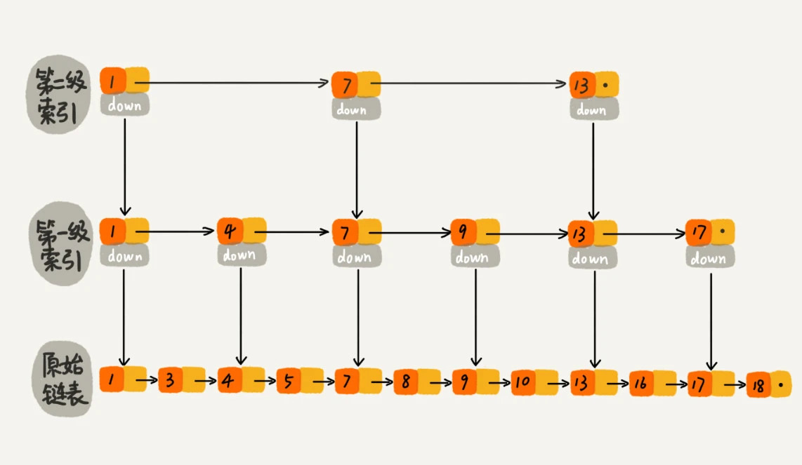

# 二分查找

查找等于

	public int bsearch(int[] a,int target){
		int low=0;
		int high=a.length-1;
		while(low<=high){
			int mid=(high-low)/2+low;
			if(a[mid]<target){
				low=mid+1;
			}else if(a[mid]>target){
				high=mid-1;
			}else{
				return mid;
			}
		}
		return -1;
	}
	
查找第一个等于

	public int bsearch(int[] a,int target){
		int low=0;
		int high=a.length-1;
		while(low<=high){
			int mid=(high-low)/2+low;
			if(a[mid]<target){
				low=mid+1;
			}else if(a[mid]>target){
				high=mid-1;
			}else{
				if(mid==0||a[mid-1]!=target){
					return mid;
				}else{
					high=mid-1;
				}
			}
		}
		return -1;
	}

查找最后一个等于

	public int bsearch(int[] a,int target){
		int low=0;
		int high=a.length-1;
		while(low<=high){
			int mid=(high-low)/2+low;
			if(a[mid]<target){
				low=mid+1;
			}else if(a[mid]>target){
				high=mid-1;
			}else{
				if(mid==n.length-1||a[mid+1]!=target){
					return mid;
				}else{
					low=mid+1;
				}
			}
		}
		return -1;
	}
	
查找第一个大于等于

	public int bsearch(int[] a,int target){
		int low=0;
		int high=a.length-1;
		while(low<=high){
			int mid=(high-low)/2+low;
			if(a[mid]>=target){
				if(mid==0||a[mid-1]<target){
					return mid;
				}else{
					high=mid-1;
				}
			}else{
				low=mid+1;
			}
		}
		return -1;
	}
	
查找最后一个小于等于

	public int bsearch(int[] a,int target){
		int low=0;
		int high=a.length-1;
		while(low<=high){
			int mid=(high-low)/2+low;
			if(a[mid]<=target){
				if(mid==n.length-1||a[mid+1]>target){
					return mid;
				}else{
					low=mid+1;
				}
			}esle{
				high=mid-1;
			}
		}
		return -1;
	}
	

搜索旋转排序数组,leetcode第33题

(target与nums[mid]已近在前面有等于判断了，后面都不用等于，其他的都要有等于)

    class Solution {
        public int search(int[] nums, int target) {
            int left=0;
            int right=nums.length-1;
            while(left<=right){
                int mid=(right-left)/2+left;
                if(nums[mid]==target){
                    return mid;
                }else if(nums[left]<=nums[mid]){
                    if(target<nums[mid]&&target>=nums[left]){
                        right=mid-1;
                    }else{
                        left=mid+1;
                    }
                }else{
                    if(target<=nums[right]&&target>nums[mid]){
                        left=mid+1;
                    }else{
                        right=mid-1;
                    }
                }
            }
            return -1;
        }
    }

## 跳表
链表加多级索引的结构，就是跳表.跳表中查询任意数据的时间复杂度就是 O(logn)。这个查找的时间复杂度跟二分查找是一样的

Redis 中的有序集合是通过跳表来实现的，严格点讲，其实还用到了散列表。如果你去查看 Redis 的开发手册，就会发现，Redis 中的有序集合支持的核心操作主要有下面这几个：

1. 插入一个数据；
2. 删除一个数据；
3. 查找一个数据；按照区间查找数据（比如查找值在[100, 356]之间的数据）；
4. 迭代输出有序序列。

其中，插入、删除、查找以及迭代输出有序序列这几个操作，红黑树也可以完成，时间复杂度跟跳表是一样的。但是，按照区间来查找数据这个操作，红黑树的效率没有跳表高。
