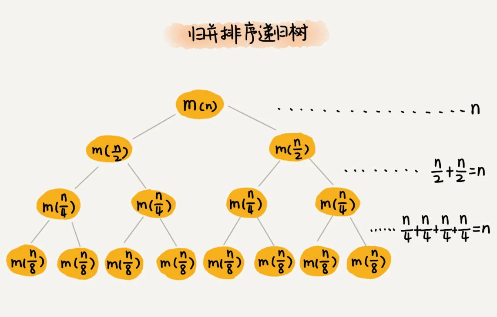

最经典的、最常用的：冒泡排序、插入排序、选择排序、归并排序、快速排序、计数排序、基数排序、桶排序

原地排序（Sorted in place）。原地排序算法，就是特指空间复杂度是 O(1) 的排序算法

稳定性。这个概念是说，如果待排序的序列中存在值相等的元素，经过排序之后，相等元素之间原有的先后顺序不变

比如说，我们现在要给电商交易系统中的“订单”排序。订单有两个属性，一个是下单时间，另一个是订单金额。如果我们现在有 10 万条订单数据，我们希望按照金额从小到大对订单数据排序。对于金额相同的订单，我们希望按照下单时间从早到晚有序。

借助稳定排序算法，这个问题可以非常简洁地解决。解决思路是这样的：我们先按照下单时间给订单排序，注意是按照下单时间，不是金额。排序完成之后，我们用稳定排序算法，按照订单金额重新排序。两遍排序之后，我们得到的订单数据就是按照金额从小到大排序，金额相同的订单按照下单时间从早到晚排序的

有序度是数组中具有有序关系的元素对的个数。有序元素对用数学表达式表示就是这样

有序元素对：a[i] <= a[j], 如果i < j。

满有序度。对于一个完全有序的数组，比如 1，2，3，4，5，6，有序度就是 n*(n-1)/2

逆序度 = 满有序度 - 有序度

## 插入排序

	// 插入排序，a表示数组，n表示数组大小
	public void insertionSort(int[] a, int n) {
	  if (n <= 1) return;
	
	  for (int i = 1; i < n; ++i) {
	    int value = a[i];
	    int j = i - 1;
	    // 查找插入的位置
	    for (; j >= 0; --j) {
	      if (a[j] > value) {
	        a[j+1] = a[j];  // 数据移动
	      } else {
	        break;
	      }
	    }
	    a[j+1] = value; // 插入数据
	  }
	}

## 快速排序

快速排序就是个二叉树的前序遍历，归并排序就是个二叉树的后序遍历

如果数据原来就是有序的或者接近有序的，每次分区点都选择最后一个数据，那快速排序算法就会变得非常糟糕，时间复杂度就会退化为 O(n2)。实际上，这种 O(n2) 时间复杂度出现的主要原因还是因为我们分区点选得不够合理。

三数取中法我们从区间的首、尾、中间，分别取出一个数，然后对比大小，取这 3 个数的中间值作为分区点。

随机法就是每次从要排序的区间中，随机选择一个元素作为分区点。

	 /* 快速排序主函数 */
    void sort(int[] nums) {
       
        sort(nums, 0, nums.length - 1);
    }

    /* 快速排序核心逻辑 */
    void sort(int[] nums, int lo, int hi) {
        if (lo >= hi) return;
       
        int p = partition(nums, lo, hi);
       
        sort(nums, lo, p - 1);
        sort(nums, p + 1, hi);
    }

    int partition(int[] nums,int lo,int hi){
        int v=nums[lo];
        int i=lo;
        int j=hi+1;
        while(true){
            while(++i<=hi&&nums[i]<v);
            while(--j>=lo&&nums[j]>v);
            if(i>=j){
                break;
            }
            swap(nums,i,j);
        }
       	swap(nums,j,lo);
        return j;
    }

    
    void swap(int[] nums, int i, int j) {
        int temp = nums[i];
        nums[i] = nums[j];
        nums[j] = temp;
    }

leetcode第215题，数组中的第K个最大的元素

	class Solution {
	    public int findKthLargest(int[] nums, int k) {
	        int n=nums.length-1;
	        return quickeSearch(nums,0,n,n-k+1);
	    }
	
	    private int quickeSearch(int[] arr,int lo,int hi,int k){
	        int j=partition(arr,lo,hi);
	        if(j==k){
	            return arr[k];
	        }
	        return j>k?quickeSearch(arr,lo,j-1,k):quickeSearch(arr,j+1,hi,k);
	    }
	
	    private int partition(int[] nums,int lo,int hi){
	        int v=nums[lo];
	        int i=lo;
	        int j=hi+1;
	        while(true){
	            while(++i<=hi&&nums[i]<v);
	            while(--j>=lo&&nums[j]>v);
	            if(i>=j){
	                break;
	            }
	            int t=nums[j];
	            nums[j]=nums[i];
	            nums[i]=t;
	        }
	        nums[lo]=nums[j];
	        nums[j]=v;
	        return j;
	    }
	}
      	
## 归并排序
归并排序不是原地排序，所以应用没有快速排序广。

复杂度分析：

	
	T(n) = 2*T(n/2) + n
	     = 2*(2*T(n/4) + n/2) + n = 4*T(n/4) + 2*n
	     = 4*(2*T(n/8) + n/4) + 2*n = 8*T(n/8) + 3*n
	     = 8*(2*T(n/16) + n/8) + 3*n = 16*T(n/16) + 4*n
	     ......
	     = 2^k * T(n/2^k) + k * n
	     ......

得到 T(n) = 2^kT(n/2^k)+kn。当 T(n/2^k)=T(1) 时，也就是 n/2^k=1，我们得到 k=log2n 。我们将 k 值代入上面的公式，得到 T(n)=Cn+nlog2n 。如果我们用大 O 标记法来表示的话，T(n) 就等于 O(nlogn)。所以归并排序的时间复杂度是 O(nlogn)。

递归树分析

  	  // 归并排序算法, a是数组，n表示数组大小
  	public static void mergeSort(int[] a, int n) {
    	mergeSortInternally(a, 0, n-1);
  	}

  	// 递归调用函数
  	private static void mergeSortInternally(int[] a, int p, int r) {
    	// 递归终止条件
    	if (p >= r) return;

    	// 取p到r之间的中间位置q,防止（p+r）的和超过int类型最大值
    	int q = p + (r - p)/2;
    	// 分治递归
    	mergeSortInternally(a, p, q);
    	mergeSortInternally(a, q+1, r);

    	// 将A[p...q]和A[q+1...r]合并为A[p...r]
    	merge(a, p, q, r);
  	}

  	private static void merge(int[] a, int p, int q, int r) {
    	int i = p;
    	int j = q+1;
    	int k = 0; // 初始化变量i, j, k
    	int[] tmp = new int[r-p+1]; // 申请一个大小跟a[p...r]一样的临时数组
    	while (i<=q && j<=r) {
      		if (a[i] <= a[j]) {
        		tmp[k++] = a[i++]; // i++等于i:=i+1
      		} else {
        		tmp[k++] = a[j++];
      		}
    	}

    	// 判断哪个子数组中有剩余的数据
    	int start = i;
    	int end = q;
    	if (j <= r) {
      		start = j;
      		end = r;
    	}

    	// 将剩余的数据拷贝到临时数组tmp
    	while (start <= end) {
      		tmp[k++] = a[start++];
    	}

    	// 将tmp中的数组拷贝回a[p...r]
    	for (i = 0; i <= r-p; ++i) {
      		a[p+i] = tmp[i];
    	}
  	}

  

## 添加括号的优先级
使用分治算法,leetcode第241题

    class Solution {
        public List<Integer> diffWaysToCompute(String expression) {
            List<Integer> res=new LinkedList<>();
            for(int i=0;i<expression.length();i++){
                char c=expression.charAt(i);
                if(c=='+'||c=='-'||c=='*'){
                    List<Integer> left=diffWaysToCompute(expression.substring(0,i));
                    List<Integer> right=diffWaysToCompute(expression.substring(i+1));
                    for(int a:left){
                        for(int b :right){
                            if(c=='+'){
                                res.add(a+b);
                            }else if(c=='-'){
                                res.add(a-b);
                            }else if(c=='*'){
                                res.add(a*b);
                            }
                        }
                    }
                }
            }
            if(res.isEmpty()){
                res.add(Integer.valueOf(expression));
            }
            return res;
        }
    }

## 桶排序，基数排序，计数排序
桶排序

如果要排序的数据有 n 个，我们把它们均匀地划分到 m 个桶内，每个桶里就有 k=n/m 个元素。每个桶内部使用快速排序，时间复杂度为 O(k * logk)。m 个桶排序的时间复杂度就是 O(m * k * logk)，因为 k=n/m，所以整个桶排序的时间复杂度就是 O(n*log(n/m))。当桶的个数 m 接近数据个数 n 时，log(n/m) 就是一个非常小的常量，这个时候桶排序的时间复杂度接近 O(n)

要排序的数据需要很容易就能划分成 m 个桶，并且，桶与桶之间有着天然的大小顺序。这样每个桶内的数据都排序完之后，桶与桶之间的数据不需要再进行排序。

计数排序

计数排序其实是桶排序的一种特殊情况。当要排序的 n 个数据，所处的范围并不大的时候，比如最大值是 k，我们就可以把数据划分成 k 个桶。

	假设只有 8 个考生，分数在 0 到 5 分之间。这 8 个考生的成绩我们放在一个数组 A[8]中，它们分别是：2，5，3，0，2，3，0，3。
	
	
	// 计数排序，a是数组，n是数组大小。假设数组中存储的都是非负整数。
	public void countingSort(int[] a, int n) {
	  if (n <= 1) return;
	
	  // 查找数组中数据的范围
	  int max = a[0];
	  for (int i = 1; i < n; ++i) {
	    if (max < a[i]) {
	      max = a[i];
	    }
	  }
	
	  int[] c = new int[max + 1]; // 申请一个计数数组c，下标大小[0,max]
	  for (int i = 0; i <= max; ++i) {
	    c[i] = 0;
	  }
	
	  // 计算每个元素的个数，放入c中
	  for (int i = 0; i < n; ++i) {
	    c[a[i]]++;
	  }
	
	  // 依次累加
	  for (int i = 1; i <= max; ++i) {
	    c[i] = c[i-1] + c[i];
	  }
	
	  // 临时数组r，存储排序之后的结果
	  int[] r = new int[n];
	  // 计算排序的关键步骤，有点难理解
	  for (int i = n - 1; i >= 0; --i) {
	    int index = c[a[i]]-1;
	    r[index] = a[i];
	    c[a[i]]--;
	  }
	
	  // 将结果拷贝给a数组
	  for (int i = 0; i < n; ++i) {
	    a[i] = r[i];
	  }
	}

## 基数排序

假设我们有 10 万个手机号码，希望将这 10 万个手机号码从小到大排序，你有什么比较快速的排序方法呢

先按照最后一位来排序手机号码，然后，再按照倒数第二位重新排序，以此类推，最后按照第一位重新排序。经过 11 次排序之后，手机号码就都有序了。

这里按照每位来排序的排序算法要是稳定的，否则这个实现思路就是不正确的

根据每一位来排序，我们可以用刚讲过的桶排序或者计数排序，它们的时间复杂度可以做到 O(n)。如果要排序的数据有 k 位，那我们就需要 k 次桶排序或者计数排序，总的时间复杂度是 O(k*n)。当 k 不大的时候，比如手机号码排序的例子，k 最大就是 11，所以基数排序的时间复杂度就近似于 O(n)。

## 堆和堆排序
堆是一个完全二叉树；

堆中每一个节点的值都必须大于等于（或小于等于）其子树中每个节点的值

	public class Heap {
	  private int[] a; // 数组，从下标1开始存储数据
	  private int n;  // 堆可以存储的最大数据个数
	  private int count; // 堆中已经存储的数据个数
	
	  public Heap(int capacity) {
	    a = new int[capacity + 1];
	    n = capacity;
	    count = 0;
	  }
	
	  public void insert(int data) {
	    if (count >= n) return; // 堆满了
	    ++count;
	    a[count] = data;
	    int i = count;
	    while (i/2 > 0 && a[i] > a[i/2]) { // 自下往上堆化
	      swap(a, i, i/2); // swap()函数作用：交换下标为i和i/2的两个元素
	      i = i/2;
	    }
	  }
	
	
		public void removeMax() {
		  if (count == 0) return -1; // 堆中没有数据
		  a[1] = a[count];
		  --count;
		  heapify(a, count, 1);
		}
		
		private void heapify(int[] a, int n, int i) { // 自上往下堆化
		  while (true) {
		    int maxPos = i;
		    if (i*2 <= n && a[i] < a[i*2]) maxPos = i*2;
		    if (i*2+1 <= n && a[maxPos] < a[i*2+1]) maxPos = i*2+1;
		    if (maxPos == i) break;
		    swap(a, i, maxPos);
		    i = maxPos;
		  }
		}
	
	}

### 堆排序
建堆，排序

	private static void buildHeap(int[] a, int n) {
	  for (int i = n/2; i >= 1; --i) {
	    heapify(a, n, i);
	  }
	}
	
	private static void heapify(int[] a, int n, int i) {
	  while (true) {
	    int maxPos = i;
	    if (i*2 <= n && a[i] < a[i*2]) maxPos = i*2;
	    if (i*2+1 <= n && a[maxPos] < a[i*2+1]) maxPos = i*2+1;
	    if (maxPos == i) break;
	    swap(a, i, maxPos);
	    i = maxPos;
	  }
	}
	
	
	
	// n表示数据的个数，数组a中的数据从下标1到n的位置。
	public static void sort(int[] a, int n) {
	  buildHeap(a, n);
	  int k = n;
	  while (k > 1) {
	    swap(a, 1, k);
	    --k;
	    heapify(a, k, 1);
	  }
	}

## JDK
在JDK中，排序相关的主要是两个工具类：Arrays.java 和 Collections.java，具体的排序方法是sort()。Collections.java中的sort()方法是将List转为数组，然后调用Arrays.sort()方法进行排序

在Arrays类中，sort()有一系列的重载方法，罗列几个典型的Arrays.sort()方法如下:

	public static void sort(int[] a) {
	     DualPivotQuicksort.sort(a, 0, a.length - 1, null, 0, 0);
	 }
	
	public static void sort(long[] a) {
	     DualPivotQuicksort.sort(a, 0, a.length - 1, null, 0, 0);
	}
	
	public static void sort(Object[] a) {
	        if (LegacyMergeSort.userRequested)
	            legacyMergeSort(a);
	        else
	            ComparableTimSort.sort(a, 0, a.length, null, 0, 0);
	}

重载方法虽然多，但是从“被排序的数组所存储的内容”这个维度可以将其分为两类：

1. 存储的数据类型是基本数据类型
2. 存储的数据类型是Object

第一种情况使用的是快排，在数据量很小的时候，使用的插入排序；
第二种情况使用的是归并排序，在数据量很小的时候，使用的也是插入排序