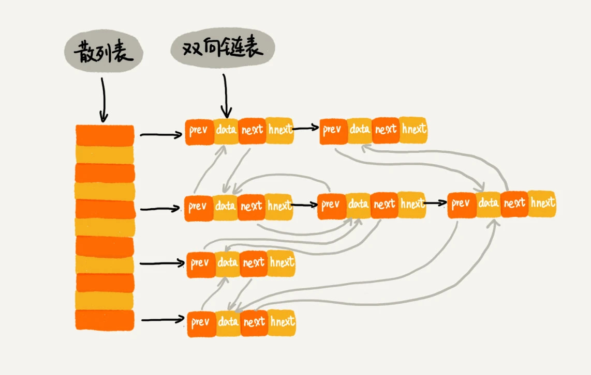

# 常用数据结构设计
## LRU

leetcode第146题,java中的LinkedHashMap使用HashMap和双向链表实现的

	public class LRUCache {
	    LinkedHashMap<Integer, Integer> hashMap;
	
	    public LRUCache(int capacity) {
	
	
	        hashMap = new LinkedHashMap<Integer, Integer>(capacity, 0.75f, true) {
	            @Override
	            protected boolean removeEldestEntry(Map.Entry eldest) {
	
	                return size() > capacity;
	            }
	        };
	    }
	
	    public int get(int key) {
	        return hashMap.getOrDefault(key, -1);
	    }
	
	    public void put(int key, int value) {
	        hashMap.put(key, value);
	    }
	
	}

## 用队列实现栈
leetcode第225题

    class MyStack {

        LinkedList<Integer> left=null;
        LinkedList<Integer> right=null;
        /** Initialize your data structure here. */
        public MyStack() {
            left=new LinkedList<>();
            right=new LinkedList<>();
        }
        
        /** Push element x onto stack. */
        public void push(int x) {
            right.offer(x);
            while(!left.isEmpty()){
                right.offer(left.poll());
            }
            LinkedList<Integer> temp=right;
            right=left;
            left=temp;
        }
        
        /** Removes the element on top of the stack and returns that element. */
        public int pop() {
            return left.poll();
        }
        
        /** Get the top element. */
        public int top() {
            return left.peek();
        }
        
        /** Returns whether the stack is empty. */
        public boolean empty() {
            return left.isEmpty();
        }
    }

## 用栈实现队列
leetcode第232题

    class MyQueue {

        /** Initialize your data structure here. */
        Stack<Integer> left=null;
        Stack<Integer> right=null;
        public MyQueue() {
            left=new Stack<>();
            right=new Stack<>();
        }
        
        /** Push element x to the back of queue. */
        public void push(int x) {
            left.push(x);
        }
        
        /** Removes the element from in front of queue and returns that element. */
        public int pop() {
            peek();
            return right.pop();
        }
        
        /** Get the front element. */
        public int peek() {
            if (right.isEmpty()){
                while (!left.isEmpty()){
                    right.push(left.pop());
                }
            }
            return right.peek();
        }
        
        /** Returns whether the queue is empty. */
        public boolean empty() {
            return left.isEmpty()&& right.isEmpty();
        }
    }

## 二叉堆

二叉堆的实现

	public class PriorityQueue{
	    private int[] pq;
	    private int size;
	
	    class PriorityQueue(int cap){
	        pa=new int[cap+1];
	    }
	
	    public int parent(int root){
	        return root/2;
	    }
	    public int left(int root){
	        return root*2;
	    }
	    public int right(int root){
	        return root*2+1;
	    }
	
	    public int insert(int x){
	        size++;
	        pq[size]=x;
	        swin(size);
	    }
	
	    public int delMax(){
	        int max=pq[1];
	        swap(1,size);
	        pq[size]=0;
	        size--;
	        sink(1);
	        return max;
	    }
	
	    //下沉
	    public void sink(int i){
	        // 如果沉到堆底，就沉不下去了
	        while (left(i) <= size) {
	            // 先假设左边节点较大
	            int max = left(i);
	            // 如果右边节点存在，比一下大小
	            if (right(i) <= size && less(max, right(i)))
	                max = right(i);
	            // 结点 x 比俩孩子都大，就不必下沉了
	            if (less(max, i)) break;
	            // 否则，不符合最大堆的结构，下沉 x 结点
	            swap(i, max);
	            i = max;
	        }
	    }
	    //上浮
	    public void swin(int i){
	        while(i>1&& less(parent(i),i)){
	            swap(parent(i),i);
	            i=parent(i);
	        }
	    }
	    public boolean less(int i,int j){
	        return pq[i]<pq[j];
	    }
	    public void swap(int i,int j){
	        int temp=pq[i];
	        pq[i]=pq[j];
	        pq[j]=temp;
	    }
	}

查看第k大元素,leetcode第215题

    class Solution {
        public int findKthLargest(int[] nums, int k) {
            PriorityQueue<Integer> queue=new PriorityQueue<>();
            for(int i=0;i<nums.length;i++){
                queue.offer(nums[i]);
                if(queue.size()>k){
                    queue.poll();
                }
            }
            return queue.peek();
        }
    }